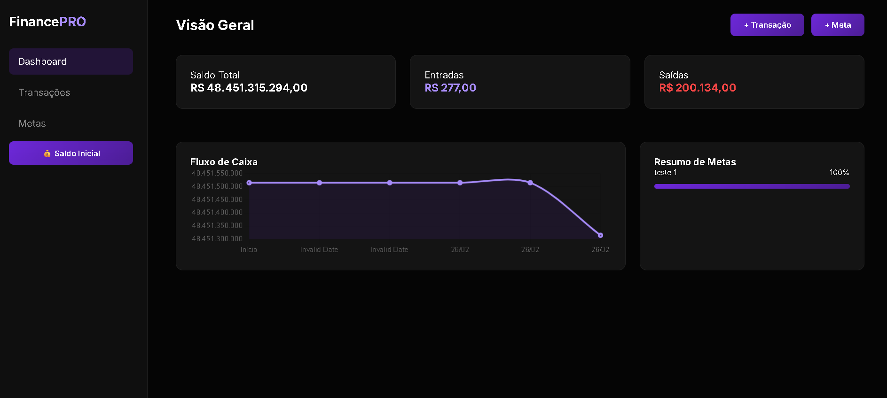

# 💜 Finance PRO - Dashboard

O **Finance PRO** é uma aplicação de gestão financeira pessoal desenvolvida para estudo. Ele oferece uma visão clara e detalhada da sua saúde financeira, com gráficos em tempo real e controle total de metas, tudo com um visual *dark premium* totalmente responsivo.

---

## ✨ Principais Funcionalidades

- 📊 **Dashboard Inteligente**: Resumo visual de saldo, entradas e saídas.
- 📈 **Gráfico Evolutivo**: Acompanhamento do fluxo de caixa através do Chart.js.
- 💸 **Gestão de Transações**: Histórico completo com busca inteligente e filtros.
- 🎯 **Sistema de Metas**: Crie objetivos financeiros e acompanhe o progresso automático.
- 📱 **Design Mobile-First**: Interface otimizada para celulares, tablets e desktop.
- 💾 **Persistência de Dados**: Armazenamento local no navegador (LocalStorage) para não perder suas informações.

---

## 🛠️ Tecnologias Utilizadas

O projeto foi construído utilizando o que há de mais moderno no desenvolvimento web "Vanilla" (sem frameworks pesados), garantindo velocidade e leveza:

- **HTML5**: Estrutura semântica.
- **CSS3**: Estilização avançada com variáveis, Flexbox e Grid.
- **JavaScript (ES6+)**: Lógica de negócios e manipulação de DOM.

---

## 🚀 Como Executar o Projeto

1. Faça o download dos arquivos ou clone o repositório!

---

# 💜 Finance PRO - Dashboard Financeiro Premium

  

---

## 📝 Estrutura de Arquivos

finance-pro/
├── index.html    # Estrutura principal e modais
├── style.css     # Estilização e regras de responsividade
├── script.js    # Lógica, cálculos e gráficos
└── README.md     # Documentação do projeto
└── License      # Licença do projeto

---

## 💜| Desenvolvido por - Ana Tech
